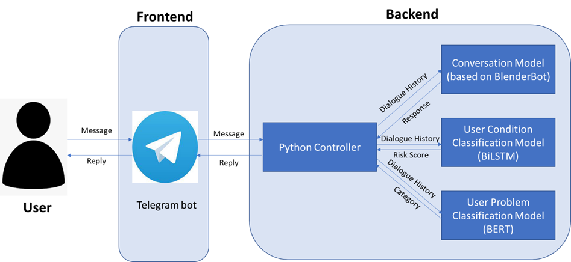

# PLP-GRP03-FT-2021-2022-Talk2Me

## SECTION 1 : PROJECT TITLE 
TalkToMe, An Emotional Detection and Psychological Support Chatbot

##

---

## SECTION 2 : EXECUTIVE SUMMARY / PAPER ABSTRACT

In recent years, there has been an increasing trend of people being affected by feelings of depression and anxiety. This has been worsened by the various stresses due to the COVID-19 pandemic. According to the World Health Organization (WHO), the global prevalence of anxiety and depression had increased by 25% in the first year of the pandemic (World Health Organization, 2022). Prolonged periods of negative emotion might lead to more serious mental health conditions, such as depression, which can be fatal if left untreated. 
Our team proposed TalkToMe, An Emotional Detection and Psychological Support Chatbot that can provide support to people who are feeling down and need comfort. TalkToMe is built using Natural Language Processing (NLP) techniques including BERT, Bi-LSTM and BlenderBot for modelling the conversations over multiple sessions, text generation and text classification. It uses the Emotional Support Conversation (ESC) framework (by Liu et al.) to support the general conversation with users.
TalkToMe interacts with user via Telegram, a widely used Messaging Platform. It has the following 3 main functions:
1. Chat with and comfort users who may be experiencing negative feelings (e.g., stress, anxiety, etc.)
2. Detect user’s condition (risk score) and provide hotlines to seek professional help
3. Detect the category of the user’s problem (e.g., emotional, work, partner relationship, friendship, school, family, and others)

To date, TalkToMe chatbot provides general emotional support to users and retrieval of hotlines or resources regarding mental well-being. In the future, we are looking at providing the following function:
1. Specific conversation support and hotlines according to users’ problem and their condition, including emotion type and intensity detected on-the-fly
2. Text summarization of users’ problem and aspect extraction of users’ feedback for further analysis and insights to improve TalkToMe chatbot
3. Rich responses support according to users' emotion and condition, including audio, video, picture, jokes, etc that can comfort them 

---

## SECTION 3 : SYSTEM ARCHITECTURE DIAGRAM

---

## SECTION 4 : CREDITS / PROJECT CONTRIBUTION

| Official Full Name  | Student ID (MTech Applicable)  | Work Items (Who Did What) | Email (Optional) |
| :------------ |:---------------:| :-----| :-----|
|Liu Ding | A0231429J |XX |e0703461@u.nus.edu |
| Mediana | A0231458E |  FrontEnd - Telegram, BackEnd - Python Controller, Conversation Model (BlenderBot), Users' Problem Classification Model (NaiveBayes, DecisionTree, SVM, CNN, BiLSTM), Project Report and User Guide Report | mediana@u.nus.edu |
|Sarah Wong | A0231507N | BackEnd - Python Controller, Conversation Model (BlenderBot), Users' Condition Classification Model (BiLSTM), Project Report, Demo Video | e0703539@u.nus.edu |
|Zeng Hanyu | A0231558A|XX |e0703590@u.nus.edu |BackEnd - inference code, Users' Problem Classification Model(Random Forest, RidgeClassifier, Voting Classifier (RF, RC, SVM)),Project Report, User Guide Report, presentation slides.
---

## SECTION 5 : USER GUIDE

Please refer to [user guide](https://github.com/mediana-medy/PLP-GRP03-FT-2021-2022-Talk2Me/blob/main/ProjectReport/Group3_TalkToMe_UserGuide.pdf)

Shared folder to download the Conversation Model (BlenderBot), Users' Problem Classification Model (BERT) and Glove:
[GoogleDrive](https://drive.google.com/drive/folders/1Bl9YKyL3kcCkyzXQ8ujgSVzVob9LvhU4?usp=sharing)

---
## SECTION 6 : PROJECT REPORT / PAPER
Refer to project report at Github Folder: [ProjectReport](https://github.com/mediana-medy/PLP-GRP03-FT-2021-2022-Talk2Me/blob/main/ProjectReport/)

